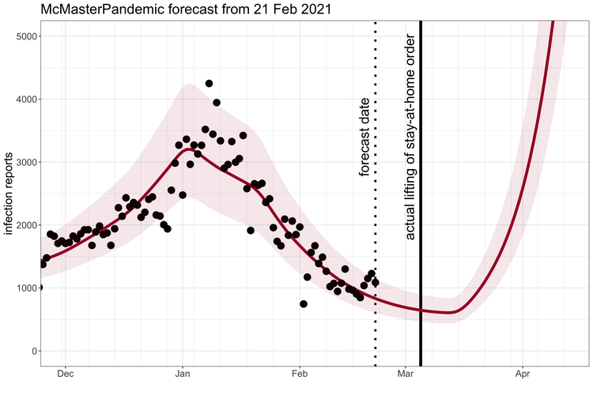

--- 
title: "Generalized McMasterPandemic"
author: "Steve Walker"
date: "`r Sys.Date()`"
site: bookdown::bookdown_site
documentclass: book
description: |
  McMasterPandemic is a modelling tool that was rapidly developed to provide timely insights into the Covid-19 Pandemic in Canada. We are currently refactoring this tool so that it is faster and more general. This guide describes how to use this refactored version of McMasterPandemic.
link-citations: yes
github-repo: canmod/macpan-book
---

# Fast and Flexible Modelling with McMasterPandemic

[McMasterPandemic](https://github.com/mac-theobio/McMasterPandemic) is a modelling tool that was rapidly developed to provide timely insights into the Covid-19 Pandemic in Canada. We are currently refactoring this tool so that it is faster and more general. This guide describes how to use this refactored version of McMasterPandemic.

## History and Motivation

### COVID-19 Forecasts

McMasterPandemic has been used to do interesting things like [predict the third wave](https://mac-theobio.github.io/forecasts/outputs/ON_accuracy.html) of the COVID-19 pandemic in Ontario Canada when case numbers were going down.

```{r third_wave, echo = FALSE}

```

### Calibration to data

McMasterPandemic has not just been an epidemic simulation tool, but can also be used to formally [calibrate](#calibration) to data. The following animation provides an illustrative example.

- observed case reports -- dots
- simulated case reports -- line
- transmission rate optimized using maximum likelihood
- negative binomial error model

```{r calibration_gif, echo = FALSE}
knitr::include_graphics("images/animation.gif")
```

### Speed

As the COVID-19 pandemic progressed, the following scenario became more common.

- Public health modeller has to make weekly forecasts
- Model fitting/calibration takes two days
- Only three days to 
   - explore scenarios
   - write the report
- No time to refine the model or messaging

So we refactored the McMasterPandemic engine using the [TMB](https://kaskr.github.io/adcomp/_book/Introduction.html) C++ framework, which resulted in the following unsolicited feedback from a senior research scientist at the Public Health Agency of Canada.


> “It is insanely fast and definitely saves me hours everyday and allows me to explore more scenarios. I can do many more things I couldn’t do before due to computational limitations.”

### Model Extensibility

Another common scenario also arose throughout the COVID-19 pandemic progressed.

- New variant emerges, as immunity from vaccination wanes
- Public health modeller has to create new model structure
- Requires a few weeks of software development
- Public health situation changes over this time
- Model is less relevant when complete

In response to this we built an [interface](#flow-between-states) allowing users to create their own compartmental model structure.
```{r eval = FALSE}
sir = (flexmodel(
    params = c(beta = 0.1, gamma = 0.01, N = 100),
    state = c(S = 99, I = 1, R = 0),
    start_date = "2020-03-11",
    end_date = "2020-12-01"
  )
  %>% add_rate("S", "I", ~ (I) * (beta) * (1/N))
  %>% add_rate("I", "R", ~ (gamma))
)
```

[This library of models](#examples) is a quick-start guide with the following examples: [SIR](#hello-world-simulating-an-sir-model), [SI], [SEIR], [two-strain SIR](#structure-two-strain-sir), [Erlang SEIR], [SIRV], [variolation SIR](#variolation-model), [SEIRD], [BC's model of the Omicron COVID variant](#bc-covid-omicron), and [Classic McMasterPandemic].

## Installation

This generalized McMasterPandemic framework is still in an experimental phase. Therefore you will need to install the `tmb-condense` code branch that contains the experimental implementation directly from github. A convenient way to do this is to use the `remotes` package as follows.

```{r eval = FALSE}
remotes::install_github("mac-theobio/McMasterPandemic@tmb-condense")
```

## Dependencies

```{r echo = FALSE, message = FALSE}
suppressPackageStartupMessages(library(ggplot2))
suppressPackageStartupMessages(library(McMasterPandemic))
suppressPackageStartupMessages(library(dplyr))
suppressPackageStartupMessages(library(tidyr))
suppressPackageStartupMessages(library(lubridate))
```

This guide makes use of the following session.
```{r sessionInfo}
sessionInfo()
```

## Generalized Model at a Glance

The general model underlying McMasterPandmic's flexible engine and interface based on a discrete time compartmental model.

$$
s_{i,t+1} = s_{i,t} + \underbrace{\sum_j M_{ji,t} s_{j,t}}_{\text{inflow}} - \underbrace{s_{i,t} \sum_j  M_{ij,t} {\mathcal I}_{ij}}_{\text{outflow}}
$$
where,

* $s_{i,t}$ is the state of the $i$th compartment at time $t$
* $M_{ij,t}$ is the per-capita rate of flow from compartment $i$ to compartment $j$ at time $t$
* ${\mathcal I}_{ij}\in\{0,1\}$ indicates whether or not individuals should be removed from compartment $i$ after flowing to compartment $j$

The per-capita rates, $M_{ij,t}$, can be any expression involving only sums and products of any of the following at time $t$:

  * State of any compartment
  * Model parameter -- either time-varying or not
  * Complements of any of the above (i.e. $1-x$)
  * Inverses of any of the above (i.e. $1/x$)
